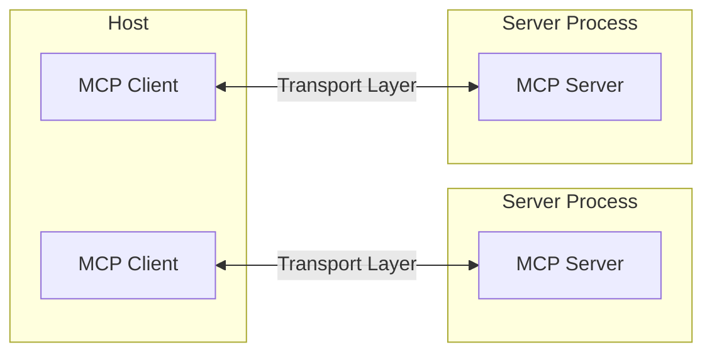
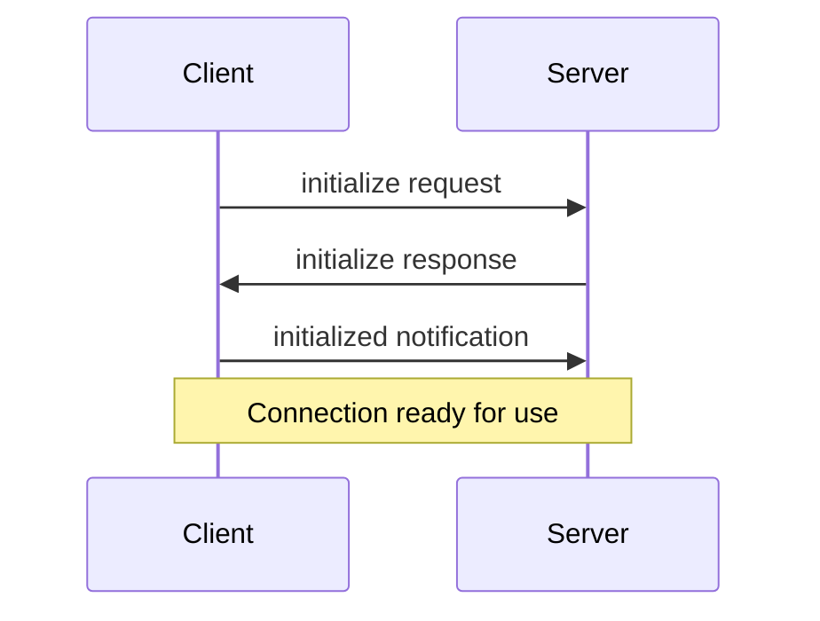

# Introduction to Model Context Protocol (MCP)

The Model Context Protocol (MCP) is designed with a flexible and extensible architecture to facilitate seamless communication between Large Language Model (LLM) applications and various integrations. This protocol defines the core architectural components and concepts necessary for this interaction.

## Overview of Model Context Protocol (MCP)

The fundamental purpose of the Model Context Protocol (MCP) is to enable LLM applications to interact effectively with external integrations. It achieves this through a structured client-server communication model.

## Client-Server Architecture

MCP operates on a client-server architecture, defining specific roles for different entities involved in the communication:

*   **Hosts**: These are the LLM applications, such as Claude Desktop or Integrated Development Environments (IDEs), that initiate connections.
*   **Clients**: Residing within the host application, clients maintain one-to-one connections with servers.
*   **Servers**: These entities are responsible for providing context, tools, and prompts to the clients.

The communication flow between these components is illustrated as follows:



## Core Components of MCP Communication

MCP communication is built upon two primary layers: the Protocol layer and the Transport layer.

### Protocol Layer

The protocol layer is responsible for managing high-level communication patterns, including message framing, and linking requests with their corresponding responses. It defines how messages are structured and processed.

Key classes within the protocol layer include `Protocol`, `Client`, and `Server`, which facilitate the handling of incoming requests and notifications, and the sending of requests and one-way notifications.

### Transport Layer

The transport layer handles the actual communication mechanism between MCP clients and servers. It supports multiple transport mechanisms to accommodate different communication scenarios:

1.  **Stdio Transport**: This mechanism utilizes standard input/output (stdin/stdout) for communication. It is particularly well-suited for local processes dueating to its efficiency for same-machine communication and simple process management.
2.  **HTTP with SSE Transport**: This transport uses Server-Sent Events (SSE) for messages flowing from the server to the client, and HTTP POST requests for messages from the client to the server. This is suitable for scenarios requiring HTTP compatibility.

All MCP transports use **JSON-RPC 2.0** for exchanging messages, adhering to a defined specification for the message format.

## Message Types

MCP defines four main types of messages for communication:

1.  **Requests**: These messages expect a response from the receiving party.
    ```typescript
    interface Request {
      method: string;
      params?: { ... };
    }
    ```
2.  **Results**: These are successful responses sent in reply to a request.
    ```typescript
    interface Result {
      [key: string]: unknown;
    }
    ```
3.  **Errors**: These messages indicate that a request has failed.
    ```typescript
    interface Error {
      code: number;
      message: string;
      data?: unknown;
    }
    ```
4.  **Notifications**: These are one-way messages that do not expect any response from the recipient.
    ```typescript
    interface Notification {
      method: string;
      params?: { ... };
    }
    ```

## Connection Lifecycle

An MCP connection follows a defined lifecycle, encompassing initialization, message exchange, and termination.

### 1. Initialization

The connection begins with an initialization handshake:



1.  The Client sends an `initialize` request to the Server, providing its protocol version and capabilities.
2.  The Server responds with its own protocol version and capabilities.
3.  The Client sends an `initialized` notification as an acknowledgment.
4.  Upon completion of these steps, the connection is ready for normal message exchange.

### 2. Message Exchange

After successful initialization, clients and servers can exchange messages using two primary patterns:

*   **Request-Response**: Either the client or the server can send requests, expecting a response from the other party.
*   **Notifications**: Both parties can send one-way messages that do not require a response.

### 3. Termination

A connection can be terminated by either party through:
*   A clean shutdown using a `close()` operation.
*   A transport disconnection.
*   The occurrence of error conditions.

## Error Handling

MCP defines standard error codes for common issues:

```typescript
enum ErrorCode {
  // Standard JSON-RPC error codes
  ParseError = -32700,
  InvalidRequest = -32600,
  MethodNotFound = -32601,
  InvalidParams = -32602,
  InternalError = -32603
}
```

SDKs and applications have the flexibility to define their own custom error codes, provided they are above -32000. Errors are propagated through error responses to requests, error events on transports, and protocol-level error handlers.

## Implementation Example

Implementing an MCP server typically involves instantiating a `Server` object, defining handlers for incoming requests, and connecting it to a chosen transport. For instance, a server might handle a `ListResourcesRequest` by returning a list of available resources.

## Best Practices

### Transport Selection

*   **Local Communication**: For processes running on the same machine, the stdio transport is recommended due to its efficiency and simplicity in process management.
*   **Remote Communication**: For scenarios requiring HTTP compatibility, the HTTP with SSE transport is suitable. Security implications, including authentication and authorization, should be considered for remote connections.

### Message Handling

*   **Request Processing**: It is crucial to validate inputs thoroughly, use type-safe schemas, handle errors gracefully, and implement timeouts for requests.
*   **Progress Reporting**: For long-running operations, progress tokens should be used to report progress incrementally, including the total progress when known.
*   **Error Management**: Employ appropriate error codes, include helpful error messages, and ensure resources are cleaned up properly upon errors.

## Security Considerations

Security is a critical aspect of MCP implementations:

*   **Transport Security**: For remote connections, TLS should be used. It is also important to validate connection origins and implement authentication when necessary.
*   **Message Validation**: All incoming messages must be validated, inputs sanitized, message size limits checked, and the JSON-RPC format verified.
*   **Resource Protection**: Implement access controls, validate resource paths, monitor resource usage, and rate limit requests to protect resources.
*   **Error Handling**: Ensure that sensitive information is not leaked through error messages, log security-relevant errors, implement proper cleanup, and handle Denial-of-Service (DoS) scenarios.

## Debugging and Monitoring

Effective debugging and monitoring are essential for maintaining MCP applications:

*   **Logging**: Log protocol events, track message flow, monitor performance, and record errors to gain insights into system behavior.
*   **Diagnostics**: Implement health checks, monitor connection state, track resource usage, and profile performance to diagnose issues.
*   **Testing**: Thoroughly test different transports, verify error handling, check edge cases, and perform load tests on servers to ensure robustness.

[[ ## completed ]]