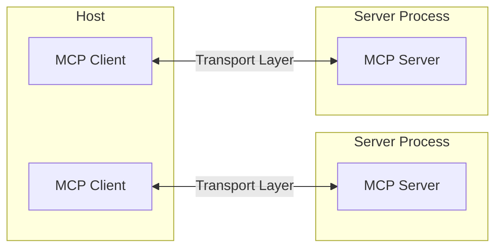
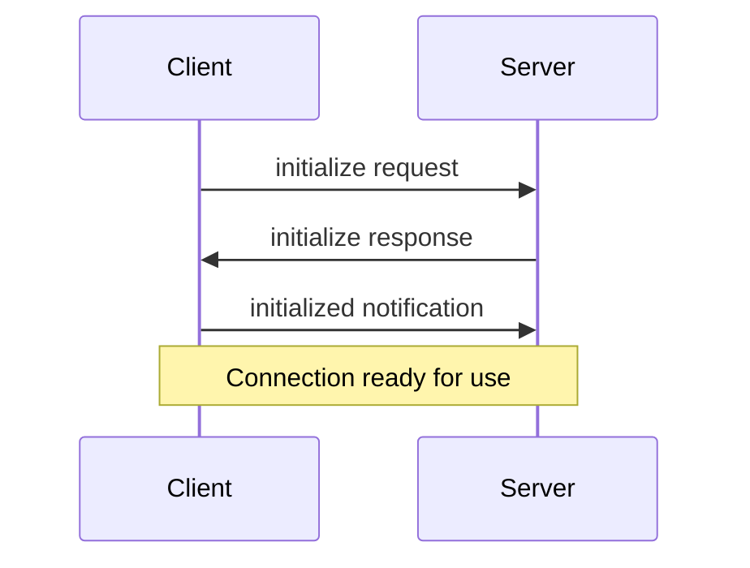

# Introduction to Model Context Protocol (MCP)

The Model Context Protocol (MCP) is designed with a flexible and extensible architecture to facilitate seamless communication between LLM applications and various integrations.

## Overview of MCP Architecture

MCP operates on a client-server architecture, defining specific roles for different components:

*   **Hosts**: These are LLM applications, such as Claude Desktop or Integrated Development Environments (IDEs), responsible for initiating connections.
*   **Clients**: These components maintain one-to-one connections with servers, operating within the host application.
*   **Servers**: These entities provide essential context, tools, and prompts to the clients.



## Core Components of MCP

MCP's architecture is built upon two primary layers: the Protocol layer and the Transport layer.

### Protocol Layer

The protocol layer is responsible for managing high-level communication patterns, including message framing and the linking of requests to their corresponding responses. Key classes within this layer include `Protocol`, `Client`, and `Server`.

### Transport Layer

The transport layer handles the actual communication mechanics between MCP clients and servers. MCP supports multiple transport mechanisms, all of which utilize [JSON-RPC 2.0](https://www.jsonrpc.org/) for message exchange. The transport layer is responsible for converting MCP protocol messages to JSON-RPC format for transmission and vice-versa for reception.

## Message Types in MCP

MCP defines four main types of messages for communication:

1.  **Requests**: These messages are sent with the expectation of a response from the receiving party.
    ```typescript
    interface Request {
      method: string;
      params?: { ... };
    }
    ```

2.  **Results**: These represent successful responses to a previously sent request.
    ```typescript
    interface Result {
      [key: string]: unknown;
    }
    ```

3.  **Errors**: These messages indicate that a request has failed.
    ```typescript
    interface Error {
      code: number;
      message: string;
      data?: unknown;
    }
    ```

4.  **Notifications**: These are one-way messages that do not require or expect a response.
    ```typescript
    interface Notification {
      method: string;
      params?: { ... };
    }
    ```

## Connection Lifecycle

An MCP connection follows a defined lifecycle, from its establishment to its termination.

### 1. Initialization

The connection initialization phase involves a handshake between the client and server:



1.  The Client sends an `initialize` request, providing its protocol version and capabilities.
2.  The Server responds with its own protocol version and capabilities.
3.  The Client sends an `initialized` notification to acknowledge the setup.
4.  Upon completion of these steps, normal message exchange can begin.

### 2. Message Exchange

After successful initialization, clients and servers can exchange messages using two primary patterns:

*   **Request-Response**: Either the client or the server can send requests and await responses.
*   **Notifications**: Both parties can send one-way messages that do not expect a response.

### 3. Termination

A connection can be terminated by either party through a clean shutdown using `close()`, a transport disconnection, or due to error conditions.

## Error Handling

MCP defines standard error codes, which are based on JSON-RPC error codes:

```typescript
enum ErrorCode {
  // Standard JSON-RPC error codes
  ParseError = -32700,
  InvalidRequest = -32600,
  MethodNotFound = -32601,
  InvalidParams = -32602,
  InternalError = -32603
}
```

SDKs and applications have the flexibility to define their own custom error codes, provided they are above -32000. Errors are propagated through error responses to requests, error events on transports, and protocol-level error handlers.

## Transports in Detail

Transports are fundamental to MCP, handling the underlying mechanics of message transmission and reception.

### Message Format

As mentioned, MCP uses JSON-RPC 2.0 as its wire format. The transport layer is responsible for converting MCP protocol messages to and from this format. The three types of JSON-RPC messages used are:

*   **Requests**:
    ```typescript
    {
      jsonrpc: "2.0",
      id: number | string,
      method: string,
      params?: object
    }
    ```

*   **Responses**:
    ```typescript
    {
      jsonrpc: "2.0",
      id: number | string,
      result?: object,
      error?: {
        code: number,
        message: string,
        data?: unknown
      }
    }
    ```

*   **Notifications**:
    ```typescript
    {
      jsonrpc: "2.0",
      method: string,
      params?: object
    }
    ```

### Built-in Transport Types

MCP includes two standard transport implementations:

1.  **Standard Input/Output (stdio) Transport**
    The stdio transport facilitates communication via standard input and output streams. It is particularly well-suited for local integrations and command-line tools.

    **Use cases for stdio transport:**
    *   Building command-line tools.
    *   Implementing local integrations.
    *   Requiring simple process communication.
    *   Working with shell scripts.

2.  **HTTP with Server-Sent Events (SSE) Transport**
    The SSE transport enables server-to-client streaming, while client-to-server communication is handled via HTTP POST requests.

    **Use cases for SSE transport:**
    *   When only server-to-client streaming is required.
    *   Operating in restricted network environments.
    *   Implementing simple updates.

### Custom Transports

MCP allows for the implementation of custom transports to meet specific communication needs. Any custom transport must conform to the `Transport` interface. This flexibility enables integration with custom network protocols, specialized communication channels, existing systems, or for performance optimization.

### Transport Error Handling

Transport implementations should be robust in handling various error scenarios, including connection errors, message parsing errors, protocol errors, network timeouts, and ensuring proper resource cleanup.

### Best Practices for Transports

When implementing or using MCP transports, it is recommended to:

*   Handle the connection lifecycle properly.
*   Implement robust error handling.
*   Clean up resources upon connection closure.
*   Utilize appropriate timeouts.
*   Validate messages before sending them.
*   Log transport events for debugging purposes.
*   Implement reconnection logic where suitable.
*   Manage backpressure in message queues.
*   Monitor connection health.
*   Implement proper security measures.

### Security Considerations for Transports

Security is paramount when implementing transports:

*   **Authentication and Authorization**: Implement proper authentication mechanisms, validate client credentials, use secure token handling, and implement authorization checks.
*   **Data Security**: Employ TLS for network transport, encrypt sensitive data, validate message integrity, implement message size limits, and sanitize input data.
*   **Network Security**: Implement rate limiting, use appropriate timeouts, handle denial of service scenarios, monitor for unusual patterns, and implement proper firewall rules.

## General Best Practices

### Transport Selection

*   For **local communication** between processes on the same machine, the stdio transport is efficient and simple.
*   For scenarios requiring **HTTP compatibility** or remote communication, SSE is a suitable choice, with due consideration for security implications like authentication and authorization.

### Message Handling

*   **Request Processing**: Thoroughly validate inputs, use type-safe schemas, handle errors gracefully, and implement timeouts.
*   **Progress Reporting**: For long-running operations, use progress tokens to report progress incrementally, including total progress when known.
*   **Error Management**: Use appropriate error codes, include helpful error messages, and ensure resources are cleaned up on errors.

## General Security Considerations

*   **Transport Security**: Always use TLS for remote connections, validate connection origins, and implement authentication when necessary.
*   **Message Validation**: Validate all incoming messages, sanitize inputs, check message size limits, and verify the JSON-RPC format.
*   **Resource Protection**: Implement access controls, validate resource paths, monitor resource usage, and rate limit requests.
*   **Error Handling**: Avoid leaking sensitive information in error messages, log security-relevant errors, implement proper cleanup, and handle Denial of Service (DoS) scenarios.

## Debugging and Monitoring

*   **Logging**: Log protocol events, track message flow, monitor performance, and record errors.
*   **Diagnostics**: Implement health checks, monitor connection state, track resource usage, and profile performance.
*   **Testing**: Test different transports, verify error handling, check edge cases, and load test servers.