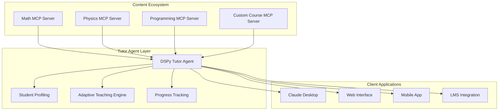

# MCP-Native Educational Agent Architecture
## Building the First AI Tutor Platform Using Model Context Protocol

---

## 🎯 Executive Summary

This document outlines the architecture for a groundbreaking educational AI system that leverages the Model Context Protocol (MCP) to create adaptive, personalized tutoring agents. By combining MCP's standardized content and prompt sharing with DSPy's adaptive reasoning capabilities, we're building the **"WordPress of AI education"** - a platform where content creators can build MCP servers with domain expertise, and educators can connect to multiple servers for comprehensive, personalized curricula.

### Key Innovation
- **First MCP-native educational platform** leveraging both tools AND prompts
- **Three-component ecosystem**: MCP Educational Servers + DSPy Tutor Agents + Client Applications
- **Distributed knowledge approach**: Multiple specialized MCP servers feeding into adaptive tutor agents

---

## 🏗️ Core Architecture Overview

---

## 🔧 Component 1: MCP Educational Servers

### Vision: Distributed Knowledge Architecture

MCP Educational Servers are specialized content and methodology providers that expose educational capabilities through the Model Context Protocol. Unlike traditional monolithic educational platforms, this distributed approach allows for:

- **Domain Specialization**: Each server can focus on specific subjects (mathematics, programming, languages, etc.)
- **Pedagogical Expertise**: Servers can implement distinct teaching methodologies and approaches
- **Community Contribution**: Anyone can create and share educational MCP servers
- **Mix-and-Match Learning**: Students and educators can combine multiple servers for comprehensive curricula

### Server Capabilities

#### Tools Layer (Model-Controlled)
Educational tools that are automatically invoked by AI agents:

- **Content Discovery**: Search and retrieve educational materials by topic, difficulty, and learning objective
- **Learning Path Generation**: Create personalized sequences of learning activities based on student profiles
- **Progress Tracking**: Monitor and record student advancement through concepts and skills
- **Assessment Creation**: Generate practice exercises, quizzes, and evaluation materials
- **Adaptive Difficulty**: Dynamically adjust content complexity based on student performance

#### Prompts Layer (User-Controlled)
Explicit teaching strategies that can be invoked for specific pedagogical approaches:

- **Concept Explanation**: Structured prompts for explaining complex topics with analogies and examples
- **Socratic Dialogue**: Guided questioning techniques to help students discover knowledge
- **Assessment and Feedback**: Templates for creating evaluations and providing constructive feedback
- **Motivational Support**: Encouragement strategies for students facing challenges
- **Learning Style Adaptation**: Customized approaches for visual, auditory, and kinesthetic learners

#### Resources Layer (Dynamic Content)
Rich educational materials dynamically served based on context:

- **Multimedia Content**: Text, images, videos, interactive simulations
- **Assessment Materials**: Practice problems, quizzes, coding challenges
- **Reference Materials**: Glossaries, concept maps, prerequisite chains
- **Progress Artifacts**: Student work, achievement records, learning analytics

### Content Processing Pipeline

#### Multi-Source Ingestion
- **Repository Cloning**: Automatic processing of educational GitHub repositories
- **Website Crawling**: Extraction of structured educational content from web sources
- **File Upload**: Direct ingestion of PDFs, documents, and multimedia materials
- **API Integration**: Connection to existing educational platforms and databases

#### Intelligent Content Analysis
- **Concept Extraction**: Identification of key learning concepts and their relationships
- **Prerequisite Mapping**: Understanding of knowledge dependencies and learning sequences
- **Difficulty Assessment**: AI-powered evaluation of content complexity and cognitive load
- **Learning Objective Alignment**: Matching content to specific educational goals and standards

#### Educational Metadata Generation
- **Time Estimation**: Predicted learning duration for concepts and activities
- **Learning Style Tagging**: Classification for different pedagogical approaches
- **Assessment Alignment**: Linking content to appropriate evaluation methods
- **Accessibility Features**: Support for diverse learning needs and abilities

---

## 🤖 Component 2: DSPy Tutor Agent

### Vision: Adaptive Intelligence for Personalized Education

The DSPy Tutor Agent serves as the intelligent orchestrator that connects students with appropriate educational content and teaching strategies. Unlike rule-based tutoring systems, this agent uses adaptive reasoning to personalize the learning experience in real-time.

### Agent Architecture

#### Learner Assessment Module
- **Initial Profiling**: Comprehensive assessment of student knowledge, learning style, and preferences
- **Ongoing Evaluation**: Continuous monitoring of student progress and understanding
- **Misconception Detection**: Identification of common errors and knowledge gaps
- **Learning Style Recognition**: Adaptation to individual cognitive and learning preferences

#### Curriculum Planning Engine
- **Personalized Path Generation**: Custom learning sequences based on student goals and current knowledge
- **Dynamic Path Adaptation**: Real-time adjustment of learning plans based on progress and performance
- **Prerequisites Management**: Ensuring proper knowledge scaffolding and dependency resolution
- **Time and Pace Optimization**: Balancing learning goals with available time and optimal learning intervals

#### Teaching Orchestrator
- **Strategy Selection**: Choosing appropriate pedagogical approaches for each learning situation
- **Multi-Modal Delivery**: Coordinating content delivery across different formats and channels
- **Interactive Dialogue**: Managing natural language conversations about learning topics
- **Context Awareness**: Maintaining understanding of ongoing learning conversations and student state

#### Adaptive Response Engine
- **Real-Time Personalization**: Adjusting responses based on immediate student feedback and performance
- **Difficulty Calibration**: Finding the optimal challenge level for individual students
- **Engagement Optimization**: Maintaining student motivation and interest throughout learning sessions
- **Remediation and Enrichment**: Providing additional support or advanced challenges as needed

### MCP Integration Strategy

#### Tool Utilization
The agent automatically leverages MCP tools to:
- Search for relevant content across multiple educational servers
- Track student progress and maintain comprehensive learning records
- Generate practice materials and assessments dynamically
- Adapt learning paths based on performance data

#### Prompt Integration
The agent strategically uses MCP prompts to:
- Apply evidence-based teaching methodologies for specific learning situations
- Provide consistent pedagogical approaches across different content domains
- Maintain educational quality and standards across diverse subject areas
- Enable customization of teaching styles for different student populations

---

## 💻 Component 3: Client Applications

### Vision: Universal Access to Personalized Education

Client applications provide the interface through which students, educators, and administrators interact with the educational ecosystem. The MCP-native architecture enables diverse client implementations while maintaining consistent educational quality.

### Client Types

#### Individual Learning Applications
- **Claude Desktop Integration**: Direct access to tutoring capabilities through conversational AI
- **Dedicated Web Interface**: Comprehensive dashboard for course management and progress tracking
- **Mobile Applications**: On-the-go learning with offline capabilities and push notifications
- **Voice Assistants**: Audio-based learning for accessibility and hands-free education

#### Educational Institution Platforms
- **Learning Management System (LMS) Integration**: Seamless embedding within existing institutional infrastructure
- **Classroom Management Tools**: Teacher dashboards for monitoring multiple students and curriculum planning
- **Assessment Platforms**: Comprehensive testing and evaluation systems with automated grading
- **Analytics Dashboards**: Administrative tools for institutional learning insights and reporting

#### Specialized Educational Tools
- **Coding Environments**: Integrated development environments with AI tutoring for programming education
- **STEM Simulation Platforms**: Interactive scientific and mathematical modeling with guided instruction
- **Language Learning Applications**: Conversation practice and immersive language experiences
- **Accessibility-Focused Clients**: Specialized interfaces for students with diverse learning needs

### Client Capabilities

#### Student Experience
- **Personalized Learning Dashboard**: Individual progress tracking, goal setting, and achievement recognition
- **Adaptive Content Delivery**: Seamless access to materials from multiple MCP servers based on learning needs
- **Interactive Learning Sessions**: Natural language tutoring conversations with contextual help and guidance
- **Progress Visualization**: Clear representation of learning advancement and areas for improvement

#### Educator Experience
- **Multi-Student Management**: Oversight and guidance for multiple learners with individualized attention
- **Curriculum Design Tools**: Creation and modification of learning paths using distributed MCP resources
- **Assessment and Analytics**: Comprehensive evaluation tools with detailed performance insights
- **Content Integration**: Easy discovery and incorporation of materials from the MCP server ecosystem

#### Administrative Experience
- **Institutional Analytics**: Aggregate learning insights for program evaluation and improvement
- **Resource Management**: Oversight of MCP server subscriptions and content access permissions
- **Quality Assurance**: Monitoring of educational outcomes and content effectiveness
- **Integration Management**: Technical administration of MCP connections and client deployments

---

## 🌟 The Revolutionary Educational Ecosystem

### Transforming Educational Technology

This architecture represents a fundamental shift from monolithic educational platforms to a distributed, interoperable ecosystem that benefits all stakeholders:

#### For Students
- **Personalized Learning at Scale**: Individual adaptation without requiring dedicated human tutors
- **Cross-Domain Integration**: Seamless learning experiences that span multiple subjects and disciplines
- **Continuous Adaptation**: Real-time adjustment to learning needs, preferences, and progress
- **Universal Access**: High-quality educational experiences regardless of geographic or economic constraints

#### For Educators
- **Enhanced Teaching Capabilities**: AI-powered assistance that amplifies rather than replaces human expertise
- **Rich Resource Access**: Easy discovery and integration of high-quality educational materials
- **Data-Driven Insights**: Comprehensive analytics for improving teaching effectiveness
- **Reduced Administrative Burden**: Automation of routine tasks like grading and progress tracking

#### For Content Creators
- **Standardized Distribution**: Consistent protocol for sharing educational expertise across platforms
- **Community-Driven Development**: Collaborative improvement of educational resources and methodologies
- **Specialized Focus**: Ability to concentrate on domain expertise rather than platform development
- **Broad Reach**: Access to learners across multiple client applications and institutions

#### For Institutions
- **Vendor Independence**: Freedom to choose and combine educational tools without lock-in
- **Cost-Effective Scalability**: Personalized education without proportional increases in staffing
- **Quality Assurance**: Standardized protocols ensure consistent educational experiences
- **Innovation Enablement**: Rapid adoption of new educational technologies and methodologies

### The Network Effect

As more MCP educational servers join the ecosystem:
- **Content Diversity Increases**: Broader range of subjects, teaching styles, and cultural perspectives
- **Quality Improves**: Community feedback and competition drive excellence in educational design
- **Innovation Accelerates**: Rapid development and testing of new pedagogical approaches
- **Accessibility Expands**: Specialized servers for different learning needs and populations

---

## 🎯 Strategic Implementation Vision

### Phase 1: Foundation Building
**Goal**: Establish core MCP educational server capabilities and basic tutor agent functionality

**Focus Areas**:
- Core MCP server architecture with essential tools and prompts
- Basic DSPy tutor agent with MCP integration
- Simple client interface for proof-of-concept demonstrations
- Initial content processing for text-based educational materials

### Phase 2: Agent Intelligence
**Goal**: Develop sophisticated adaptive tutoring capabilities and multi-server integration

**Focus Areas**:
- Advanced student profiling and learning analytics
- Sophisticated teaching strategy selection and adaptation
- Multi-server content discovery and integration
- Enhanced client interfaces with rich interactive features

### Phase 3: Ecosystem Development
**Goal**: Enable community contribution and diverse client application development

**Focus Areas**:
- Tools and documentation for creating educational MCP servers
- Advanced client APIs and integration frameworks
- Community marketplace and quality assurance processes
- Comprehensive analytics and institutional management tools

### Phase 4: Scale and Specialization
**Goal**: Support large-scale deployment and specialized educational applications

**Focus Areas**:
- Performance optimization for institutional-scale deployment
- Specialized servers for diverse educational domains and methodologies
- Advanced accessibility and internationalization features
- Research and development partnerships with educational institutions

---

## 🏆 The Long-Term Impact

### Democratizing Quality Education

This MCP-native educational ecosystem has the potential to fundamentally transform access to quality education by:

- **Eliminating Geographic Barriers**: High-quality tutoring available anywhere with internet access
- **Reducing Economic Barriers**: Open-source foundation enables affordable educational solutions
- **Supporting Diverse Learning Needs**: Adaptive technology accommodates different abilities and preferences
- **Scaling Human Expertise**: Expert knowledge embedded in MCP servers reaches unlimited students

### Advancing Educational Research

The standardized data collection and analysis capabilities enable:

- **Large-Scale Learning Analytics**: Understanding of learning patterns across diverse populations
- **Pedagogical Innovation**: Rapid testing and refinement of new teaching methodologies
- **Evidence-Based Education**: Data-driven insights into effective educational practices
- **Personalization Science**: Advanced understanding of individual learning optimization

### Creating Sustainable Educational Innovation

The ecosystem approach ensures:

- **Continuous Improvement**: Community-driven enhancement of educational resources and methods
- **Sustainable Development**: Economic incentives for high-quality educational content creation
- **Technology Evolution**: Seamless integration of new AI capabilities and educational research
- **Global Collaboration**: International cooperation in educational technology development

---

## 🔮 Future Possibilities

As this ecosystem matures, it opens possibilities for revolutionary educational experiences:

- **AI Teaching Assistants**: Sophisticated AI tutors that complement human educators
- **Immersive Learning Environments**: Virtual and augmented reality experiences with AI guidance
- **Predictive Education**: Early identification and intervention for learning challenges
- **Lifelong Learning Companions**: AI tutors that grow and adapt with learners throughout their lives
- **Global Educational Exchange**: Seamless access to educational expertise from around the world

This MCP-native educational agent architecture represents more than a technological advancement—it's a vision for the future of learning itself, where high-quality, personalized education becomes a universal human right enabled by intelligent, adaptive technology.