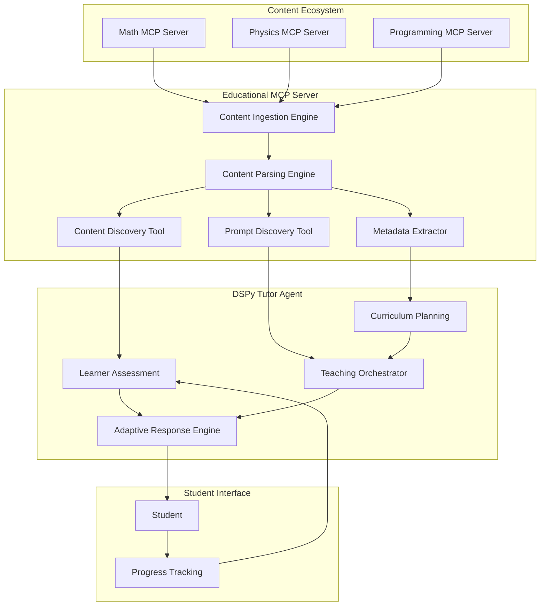

# MCP-Native Educational Agent Architecture
## Building the First AI Tutor Platform Using Model Context Protocol

---

## 🎯 Executive Summary

This document outlines the architecture for a groundbreaking educational AI system that leverages the Model Context Protocol (MCP) to create adaptive, personalized tutoring agents. By combining MCP's standardized content and prompt sharing with DSPy's adaptive reasoning capabilities, we're building the **"WordPress of AI education"** - a platform where content creators can build MCP servers with domain expertise, and educators can connect to multiple servers for comprehensive, personalized curricula.

### Key Innovation
- **First MCP-native educational platform** leveraging both tools AND prompts
- **Two-layer system**: Reactive layer (tools) for content discovery + Instructional layer (prompts) for teaching methodologies
- **Ecosystem approach**: Multiple specialized MCP servers feeding into adaptive tutor agents

---

## 🏗️ Core Architecture Overview



---

## 🛠️ MCP Server Architecture

### Core MCP Capabilities

The educational MCP server exposes four key MCP capabilities:

```python
from mcp.server import Server
import mcp.types as types

class EducationalMCPServer:
    def __init__(self):
        self.server = Server("educational-content-server")
        
        # MCP Capabilities
        self.capabilities = {
            "tools": {},           # For content discovery and management
            "prompts": {},         # For teaching templates
            "resources": {},       # For content delivery
            "logging": {}          # For student progress tracking
        }
```

### 1. Tools Layer (Model-Controlled)

Tools are **automatically invoked** by the AI agent for content discovery and progress tracking:

```python
@server.list_tools()
async def list_tools() -> list[types.Tool]:
    return [
        types.Tool(
            name="search_content",
            description="Search for educational content by topic and difficulty",
            inputSchema={
                "type": "object",
                "properties": {
                    "query": {"type": "string"},
                    "difficulty_level": {"type": "string", "enum": ["beginner", "intermediate", "advanced"]},
                    "content_type": {"type": "string", "enum": ["concept", "example", "exercise"]}
                },
                "required": ["query"]
            },
            annotations={
                "title": "Content Search",
                "readOnlyHint": True,
                "openWorldHint": False  # Closed system - our content only
            }
        ),
        
        types.Tool(
            name="get_learning_path",
            description="Generate a personalized learning path for objectives",
            inputSchema={
                "type": "object", 
                "properties": {
                    "learning_objectives": {"type": "array", "items": {"type": "string"}},
                    "student_profile": {"type": "object"},
                    "time_constraints": {"type": "string"}
                }
            },
            annotations={
                "readOnlyHint": True,
                "idempotentHint": True
            }
        ),
        
        types.Tool(
            name="track_progress",
            description="Record student progress and update knowledge state",
            inputSchema={
                "type": "object",
                "properties": {
                    "student_id": {"type": "string"},
                    "concept": {"type": "string"},
                    "mastery_level": {"type": "number", "minimum": 0, "maximum": 1}
                }
            },
            annotations={
                "readOnlyHint": False,
                "destructiveHint": False,  # Updates but doesn't destroy
                "idempotentHint": False
            }
        ),
        
        types.Tool(
            name="generate_practice_exercises",
            description="Create practice problems for a specific concept",
            inputSchema={
                "type": "object",
                "properties": {
                    "concept": {"type": "string"},
                    "difficulty": {"type": "string"},
                    "quantity": {"type": "integer", "minimum": 1, "maximum": 10}
                }
            }
        )
    ]
```

### 2. Prompts Layer (User-Controlled)

Prompts provide **explicit teaching strategies** that can be invoked for specific pedagogical approaches:

```python
@server.list_prompts()
async def list_prompts() -> list[types.Prompt]:
    return [
        types.Prompt(
            name="explain_concept",
            description="Explain a concept adapted to student's learning style",
            arguments=[
                types.PromptArgument(
                    name="concept",
                    description="The concept to explain",
                    required=True
                ),
                types.PromptArgument(
                    name="learning_style", 
                    description="Student's preferred learning style (visual, auditory, kinesthetic)",
                    required=False
                ),
                types.PromptArgument(
                    name="prior_knowledge",
                    description="What the student already knows about related topics",
                    required=False
                ),
                types.PromptArgument(
                    name="analogy_domain",
                    description="Domain for analogies (sports, cooking, nature, etc.)",
                    required=False
                )
            ]
        ),
        
        types.Prompt(
            name="socratic_dialogue",
            description="Guide student through Socratic method discovery",
            arguments=[
                types.PromptArgument(name="concept", required=True),
                types.PromptArgument(name="student_misconception", required=False)
            ]
        ),
        
        types.Prompt(
            name="create_assessment",
            description="Generate assessment questions for a concept",
            arguments=[
                types.PromptArgument(name="concept", required=True),
                types.PromptArgument(name="difficulty_level", required=True),
                types.PromptArgument(name="question_type", required=False)
            ]
        ),
        
        types.Prompt(
            name="provide_feedback", 
            description="Give constructive feedback on student work",
            arguments=[
                types.PromptArgument(name="student_response", required=True),
                types.PromptArgument(name="correct_answer", required=True),
                types.PromptArgument(name="encouragement_level", required=False)
            ]
        ),
        
        types.Prompt(
            name="motivational_support",
            description="Provide encouragement and motivation when student is struggling",
            arguments=[
                types.PromptArgument(name="struggle_area", required=True),
                types.PromptArgument(name="student_strengths", required=False)
            ]
        )
    ]

@server.get_prompt()
async def get_prompt(name: str, arguments: dict) -> types.GetPromptResult:
    if name == "explain_concept":
        concept = arguments.get("concept", "")
        learning_style = arguments.get("learning_style", "visual")
        prior_knowledge = arguments.get("prior_knowledge", "none")
        analogy_domain = arguments.get("analogy_domain", "everyday life")
        
        return types.GetPromptResult(
            messages=[
                types.PromptMessage(
                    role="system",
                    content=types.TextContent(
                        type="text",
                        text=f"""You are an expert tutor with deep pedagogical knowledge. Explain {concept} to a student with {learning_style} learning style who has {prior_knowledge} prior knowledge. 

Use analogies from {analogy_domain}, provide step-by-step breakdowns, and include concrete examples. Adapt your explanation style:
- Visual learners: Use diagrams, charts, visual metaphors
- Auditory learners: Use verbal explanations, mnemonics, sound patterns  
- Kinesthetic learners: Use hands-on activities, movement, physical analogies

Always check for understanding and encourage questions."""
                    )
                ),
                types.PromptMessage(
                    role="user", 
                    content=types.TextContent(
                        type="text",
                        text=f"Please explain {concept} in a way I can understand."
                    )
                )
            ]
        )
    
    elif name == "socratic_dialogue":
        concept = arguments.get("concept", "")
        misconception = arguments.get("student_misconception", "")
        
        return types.GetPromptResult(
            messages=[
                types.PromptMessage(
                    role="system",
                    content=types.TextContent(
                        type="text",
                        text=f"""You are a Socratic tutor. Guide the student to discover {concept} through questioning rather than direct explanation. 

{f"The student has this misconception: {misconception}. Help them discover the correct understanding." if misconception else ""}

Use the Socratic method:
1. Ask probing questions that expose assumptions
2. Help student examine their thinking
3. Guide them to contradictions in their reasoning
4. Let them reach insights through discovery
5. Build understanding step by step through inquiry

Never give direct answers - always respond with questions that lead to understanding."""
                    )
                ),
                types.PromptMessage(
                    role="user",
                    content=types.TextContent(
                        type="text", 
                        text=f"I want to understand {concept}. Can you help me figure it out?"
                    )
                )
            ]
        )
```

### 3. Resources Layer (Dynamic Content)

```python
@server.list_resources()
async def list_resources() -> list[types.Resource]:
    # Dynamically generate resource list based on ingested content
    resources = []
    
    # Content resources with educational metadata
    for content_item in await self.content_indexer.get_all_content():
        resources.append(types.Resource(
            uri=f"content://{content_item.domain}/{content_item.topic}",
            name=content_item.title,
            description=f"Educational content on {content_item.topic}",
            mimeType="text/markdown"
        ))
    
    # Assessment resources
    for assessment in await self.assessment_generator.get_assessments():
        resources.append(types.Resource(
            uri=f"assessment://{assessment.topic}/{assessment.difficulty}",
            name=f"{assessment.topic} Assessment",
            description=f"Practice problems for {assessment.topic}",
            mimeType="application/json"
        ))
    
    return resources

@server.read_resource()
async def read_resource(uri: str) -> str:
    # Parse URI and return appropriate content
    if uri.startswith("content://"):
        return await self.content_store.get_content(uri)
    elif uri.startswith("assessment://"):
        return await self.assessment_store.get_assessment(uri)
    else:
        raise ValueError(f"Unknown resource URI: {uri}")
```

### 4. Core Content Processing Engines

```python
class ContentIngestionEngine:
    """Handles multi-format content intake"""
    async def ingest_url(self, url: str) -> ContentSource
    async def ingest_file(self, file_path: str) -> ContentSource  
    async def ingest_api(self, api_config: dict) -> ContentSource
    async def ingest_structured_data(self, data: dict) -> ContentSource

class ContentParsingEngine:
    """Extracts teachable units from raw content"""
    async def extract_concepts(self, content: ContentSource) -> List[Concept]
    async def identify_prerequisites(self, concepts: List[Concept]) -> DependencyGraph
    async def chunk_for_learning(self, content: ContentSource) -> List[LearningChunk]
    async def extract_examples(self, content: ContentSource) -> List[Example]

class MetadataExtractor:
    """Extracts educational metadata"""
    async def estimate_difficulty(self, content: LearningChunk) -> DifficultyLevel
    async def estimate_time_required(self, content: LearningChunk) -> TimeEstimate
    async def identify_learning_objectives(self, content: ContentSource) -> List[LearningObjective]
    async def classify_content_type(self, content: LearningChunk) -> ContentType

class ContentIndexingEngine:
    """Creates searchable knowledge graph"""
    async def build_concept_graph(self, content: ContentSource) -> ConceptGraph
    async def identify_learning_paths(self, start: Concept, end: Concept) -> List[LearningPath]
    async def index_for_search(self, content: List[LearningChunk]) -> SearchIndex
```

---

## 🤖 DSPy Tutor Agent Architecture

### MCP-Native DSPy Integration

Based on the DSPy MCP tutorial pattern, the agent integrates seamlessly with MCP servers:

```python
import dspy
from mcp import ClientSession, StdioServerParameters
from mcp.client.stdio import stdio_client

class AdaptiveTutorSignature(dspy.Signature):
    """You are an adaptive AI tutor that uses MCP tools and prompts to provide personalized education."""
    
    student_query: str = dspy.InputField()
    student_profile: str = dspy.InputField(desc="Student's learning style, knowledge level, and preferences")
    learning_objective: str = dspy.InputField()
    conversation_history: str = dspy.InputField(desc="Previous interactions with this student")
    
    teaching_response: str = dspy.OutputField(desc="Personalized teaching response")
    next_action: str = dspy.OutputField(desc="Recommended next step for the student")
    confidence_level: float = dspy.OutputField(desc="Confidence in the response quality (0-1)")

class MCPEducationalAgent:
    def __init__(self, mcp_server_params):
        self.server_params = mcp_server_params
        self.dspy_tools = []
        self.teaching_prompts = {}
        self.session = None
        
    async def initialize(self):
        """Connect to MCP server and gather tools/prompts"""
        async with stdio_client(self.server_params) as (read, write):
            async with ClientSession(read, write) as session:
                await session.initialize()
                self.session = session
                
                # Gather tools (model-controlled)
                tools = await session.list_tools()
                for tool in tools.tools:
                    self.dspy_tools.append(dspy.Tool.from_mcp_tool(session, tool))
                
                # Gather prompts (user-controlled)
                prompts = await session.list_prompts()
                for prompt in prompts.prompts:
                    self.teaching_prompts[prompt.name] = prompt
                
                # Create adaptive agent with ReAct
                self.react_agent = dspy.ReAct(
                    AdaptiveTutorSignature, 
                    tools=self.dspy_tools
                )
    
    async def teach(self, student_query: str, student_profile: dict, conversation_history: list = None):
        """Main teaching method that combines ReAct with MCP prompts"""
        
        # Phase 1: Use ReAct to analyze and gather information
        react_result = await self.react_agent.acall(
            student_query=student_query,
            student_profile=str(student_profile),
            learning_objective="Help student understand the concept thoroughly",
            conversation_history=str(conversation_history or [])
        )
        
        # Phase 2: Determine best teaching approach based on student profile
        teaching_strategy = self._select_teaching_strategy(
            student_profile, 
            react_result.teaching_response
        )
        
        # Phase 3: Use appropriate MCP prompt for refined pedagogy
        if teaching_strategy == "socratic":
            refined_response = await self._use_teaching_prompt(
                "socratic_dialogue",
                {
                    "concept": self._extract_main_concept(react_result.teaching_response),
                    "student_misconception": self._detect_misconception(student_query)
                }
            )
        elif teaching_strategy == "explanatory":
            refined_response = await self._use_teaching_prompt(
                "explain_concept",
                {
                    "concept": self._extract_main_concept(react_result.teaching_response),
                    "learning_style": student_profile.get("learning_style", "visual"),
                    "prior_knowledge": student_profile.get("knowledge_level", "beginner"),
                    "analogy_domain": student_profile.get("interests", "everyday life")
                }
            )
        else:
            refined_response = react_result.teaching_response
        
        # Phase 4: Track progress and suggest next steps
        await self._track_student_progress(student_profile["id"], react_result)
        
        return {
            "response": refined_response,
            "next_action": react_result.next_action,
            "confidence": react_result.confidence_level,
            "teaching_strategy": teaching_strategy
        }
    
    def _select_teaching_strategy(self, student_profile: dict, content: str) -> str:
        """Select the most appropriate teaching strategy"""
        learning_style = student_profile.get("learning_style", "visual")
        knowledge_level = student_profile.get("knowledge_level", "beginner")
        
        # Simple strategy selection logic (could be enhanced with ML)
        if knowledge_level == "advanced" and "misconception" in content.lower():
            return "socratic"
        elif learning_style in ["visual", "kinesthetic"]:
            return "explanatory"
        else:
            return "conversational"
    
    async def _use_teaching_prompt(self, prompt_name: str, arguments: dict) -> str:
        """Execute an MCP prompt with given arguments"""
        prompt_result = await self.session.get_prompt(prompt_name, arguments)
        
        # Convert MCP prompt result to LLM conversation
        # This would integrate with your LLM of choice
        llm_response = await self._execute_prompt_with_llm(prompt_result.messages)
        return llm_response
    
    async def _track_student_progress(self, student_id: str, result):
        """Track student progress using MCP tools"""
        # Extract concepts covered in this interaction
        concepts = self._extract_concepts(result.teaching_response)
        
        # Update progress for each concept
        for concept in concepts:
            mastery_level = self._estimate_mastery(result.confidence_level)
            await self._call_mcp_tool("track_progress", {
                "student_id": student_id,
                "concept": concept,
                "mastery_level": mastery_level
            })
```

### Agent Core Modules

```python
class LearnerAssessmentModule:
    """Initial user profiling and ongoing assessment"""
    async def conduct_initial_assessment(self) -> UserProfile
    async def identify_learning_style(self, interactions: List[Interaction]) -> LearningStyle
    async def assess_prior_knowledge(self, domain: str) -> KnowledgeState
    async def track_progress(self, student_id: str) -> ProgressState
    async def detect_struggling_areas(self, student_id: str) -> List[Concept]

class CurriculumPlanningModule:
    """Creates personalized learning paths"""
    async def generate_learning_path(self, objectives: List[LearningObjective], 
                                   user_profile: UserProfile) -> LearningPath
    async def adapt_path_based_on_progress(self, path: LearningPath, 
                                         progress: ProgressState) -> LearningPath
    async def estimate_completion_time(self, path: LearningPath) -> TimeEstimate
    async def suggest_review_sessions(self, student_id: str) -> List[ReviewSession]

class TeachingOrchestrator:
    """Coordinates the teaching process"""
    async def select_teaching_strategy(self, concept: Concept, 
                                     learner_state: LearnerState) -> TeachingStrategy
    async def deliver_lesson(self, lesson: Lesson, strategy: TeachingStrategy) -> LessonResult
    async def handle_questions(self, question: str, context: LessonContext) -> Response
    async def provide_feedback(self, student_response: str, expected: str) -> Feedback
    async def adjust_difficulty(self, current_level: float, performance: float) -> float

class AdaptiveResponseEngine:
    """DSPy-powered adaptive responses"""
    async def generate_explanation(self, concept: Concept, style: LearningStyle) -> Explanation
    async def create_practice_problem(self, concept: Concept, difficulty: DifficultyLevel) -> Problem
    async def provide_hint(self, problem: Problem, attempt: StudentAttempt) -> Hint
    async def generate_encouragement(self, struggle_area: str, strengths: List[str]) -> str
```

---

## 🎯 Implementation Roadmap

### Phase 1: Core MCP Server (4-6 weeks)
**Goal**: Build minimal viable educational MCP server

```python
# Core capabilities to implement first
class MinimalEducationalMCP:
    capabilities = {
        "tools": {},
        "prompts": {},
        "resources": {}
    }
    
    # Essential tools
    core_tools = [
        "search_content",           # Basic content discovery
        "track_progress",          # Simple progress tracking
        "get_learning_path"        # Basic path generation
    ]
    
    # Essential prompts  
    core_prompts = [
        "explain_concept",         # Basic explanations
        "create_assessment",       # Simple assessments
        "provide_feedback"         # Basic feedback
    ]
    
    # Basic content ingestion
    supported_formats = ["markdown", "pdf", "text"]
```

**Deliverables**:
- ✅ MCP server with basic tools and prompts
- ✅ Content ingestion for markdown/text files
- ✅ Simple progress tracking
- ✅ Basic prompt templates

### Phase 2: DSPy Agent Integration (3-4 weeks)  
**Goal**: Create MCP-native DSPy tutor agent

```python
# Core agent functionality
class BaseTutorAgent:
    def __init__(self, mcp_server):
        self.tools = dspy.Tool.from_mcp_tools(mcp_server.tools)
        self.prompts = mcp_server.prompts
        self.agent = dspy.ReAct(TeachingSignature, tools=self.tools)
    
    async def teach_concept(self, concept: str, student: StudentProfile):
        # Basic teaching workflow
        result = await self.agent.acall(
            concept=concept,
            student_profile=str(student)
        )
        return result
```

**Deliverables**:
- ✅ MCP client integration with DSPy
- ✅ Basic ReAct agent for teaching
- ✅ Simple student profiling
- ✅ Prompt execution system

### Phase 3: Advanced Features (6-8 weeks)
**Goal**: Production-ready system with advanced pedagogy

**Advanced Content Processing**:
```python
class AdvancedContentProcessor:
    features = [
        "concept_graph_generation",     # Knowledge graph creation
        "prerequisite_detection",       # Learning dependency analysis  
        "difficulty_estimation",        # AI-powered difficulty scoring
        "multi_modal_support",         # Images, videos, interactive content
        "collaborative_learning"        # Multi-student scenarios
    ]
```

**Advanced Teaching Strategies**:
```python
class AdvancedTeachingStrategies:
    strategies = [
        "adaptive_socratic_method",     # Dynamic Socratic questioning
        "spaced_repetition",           # Memory-optimized review
        "zone_of_proximal_development", # Vygotsky-inspired difficulty adjustment
        "peer_learning_simulation",     # Simulated peer interactions
        "gamification_elements"        # Achievement and progress systems
    ]
```

**Deliverables**:
- ✅ Advanced content parsing and analysis
- ✅ Sophisticated teaching strategy selection
- ✅ Multi-modal content support
- ✅ Comprehensive progress analytics
- ✅ Integration testing with multiple content domains

### Phase 4: Ecosystem & Production (4-6 weeks)
**Goal**: Scalable platform ready for ecosystem growth

```python
class ProductionPlatform:
    features = [
        "mcp_server_marketplace",      # Directory of educational MCP servers
        "content_creator_tools",       # Tools for building educational MCP servers  
        "educator_dashboard",          # Teacher/admin interface
        "analytics_and_insights",     # Learning analytics platform
        "api_and_integrations"        # Integration with LMS platforms
    ]
```

**Deliverables**:
- ✅ Scalable server infrastructure
- ✅ Content creator documentation and tools  
- ✅ Educator interface and dashboard
- ✅ API for third-party integrations
- ✅ Performance optimization and monitoring

---

## 🏆 The Game-Changing Opportunity

### Building the "WordPress of AI Education"

This architecture creates a **transformative educational ecosystem**:

1. **Content Creators** build specialized MCP servers with domain expertise
2. **Educators** connect to multiple MCP servers for comprehensive curricula  
3. **Students** receive personalized tutoring powered by distributed knowledge
4. **Institutions** can mix and match content sources without vendor lock-in

### Example Ecosystem Architecture

```
Math MCP Server ──────┐
                       │
Physics MCP Server ────┼── Your Tutor Agent ──── Student
                       │
Programming MCP ───────┘
```

### Unique Value Propositions

**For Students**:
- Personalized learning adapted to individual style and pace
- Access to expertise from multiple domains simultaneously  
- Consistent progress tracking across all subjects
- Interactive, engaging educational experience

**For Educators**:
- Easy integration of diverse content sources
- Powerful analytics and progress insights
- Customizable teaching strategies and prompts
- Reduced content creation burden

**For Content Creators**:
- Standardized protocol for sharing educational content
- Built-in discovery and integration mechanisms
- Reusable across different educational platforms
- Community-driven content ecosystem

**For Institutions**:
- Vendor-agnostic educational technology stack
- Scalable across different subjects and levels
- Integration with existing LMS platforms
- Cost-effective personalized education at scale

---

## 🔥 Critical Success Factors

### 1. **Start with MCP Server Architecture**
The MCP server is your core differentiator. A well-designed server architecture enables:
- Easy content ingestion from diverse sources
- Standardized tool and prompt interfaces
- Seamless integration with multiple client applications
- Community-driven ecosystem growth

### 2. **Leverage Both Tools AND Prompts**  
The dual-layer approach is revolutionary:
- **Tools** (model-controlled): Automated content discovery, progress tracking, adaptive path generation
- **Prompts** (user-controlled): Explicit pedagogical strategies, teaching methodologies, assessment techniques

### 3. **Design for Ecosystem Growth**
Make it trivial for others to contribute:
- Clear documentation for creating educational MCP servers
- Standard schemas for educational metadata  
- Community marketplace for discovering content servers
- Tools for validating and testing educational content

### 4. **Implement Robust Progress Tracking**
Data-driven adaptation is crucial:
- Detailed analytics on learning patterns and outcomes
- Real-time adjustment of teaching strategies
- Long-term retention and spaced repetition optimization
- Multi-dimensional progress tracking (knowledge, engagement, confidence)

### 5. **Focus on Pedagogical Excellence**
Ensure the AI tutoring is educationally sound:
- Evidence-based teaching strategies
- Support for diverse learning styles and needs
- Proper scaffolding and zone of proximal development
- Assessment validity and reliability

---

## 🎯 Conclusion

This MCP-native educational agent architecture represents a paradigm shift in AI-powered education. By leveraging the Model Context Protocol's standardization capabilities with DSPy's adaptive reasoning, we're creating the first truly extensible, community-driven AI tutoring platform.

The combination of MCP's tool and prompt system with DSPy's ReAct capabilities creates a powerful foundation for personalized, adaptive education that can scale across domains, institutions, and learning contexts.

**This could become the standard protocol for AI education** - the infrastructure that enables a thriving ecosystem of educational AI applications, content creators, and learners.

---

## 📚 Appendix: Technical References

### MCP Specification
- [MCP Tools Documentation](https://docs.modelcontextprotocol.io/concepts/tools)
- [MCP Prompts Documentation](https://docs.modelcontextprotocol.io/concepts/prompts)  
- [MCP Architecture Guide](https://docs.modelcontextprotocol.io/concepts/architecture)

### DSPy Integration
- [DSPy MCP Tutorial](https://dspy.ai/tutorials/mcp/)
- [DSPy ReAct Documentation](https://dspy.ai/api/modules/ReAct/)
- [DSPy Tool System](https://dspy.ai/api/primitives/Tool/)

### Educational Technology
- [Learning Sciences Research on Adaptive Systems](https://link.springer.com/journal/11423)
- [Intelligent Tutoring Systems](https://www.springer.com/journal/40593)
- [Educational Data Mining](https://educationaldatamining.org/)