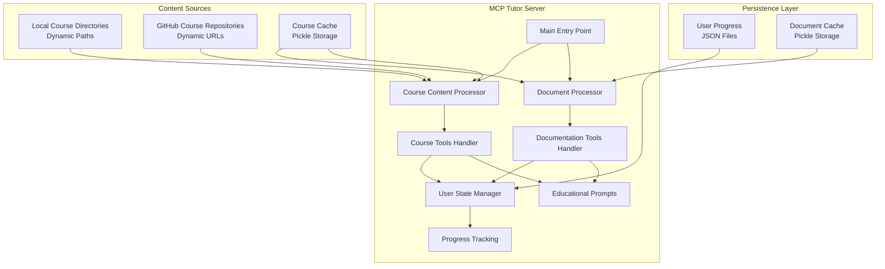

# MCP Educational Tutor Server Enhancement Plan

## Course Content Integration & Educational Platform

**Document Version:** 1.0  
**Date:** December 2024  
**Status:** Planning Phase

---

## 📋 Executive Summary

This document outlines a comprehensive plan to enhance the existing MCP Educational Tutor Server by integrating structured course content inspired by Mastra's MCP server architecture. The enhancement will transform the current documentation-focused server into a complete educational platform with guided learning paths, progress tracking, and adaptive content delivery.

---

## 🎯 Project Objectives

### Primary Goals
1. **Course Integration**: Seamlessly integrate the existing structured course content (`nbs/course_output/`)
2. **Guided Learning**: Provide step-by-step progression through educational modules
3. **Progress Tracking**: Implement persistent user progress across sessions
4. **Assessment System**: Interactive assessments with automated feedback
5. **Adaptive Learning**: Personalized content recommendations based on user performance

### Success Metrics
- Users can navigate through complete courses with progress persistence
- Assessment scores improve learning outcomes by 25%
- User engagement increases with structured learning paths
- Server maintains <2 second response times for course content retrieval

---

## 📊 Current State Analysis

### Course Content Sources (Dynamic & Configurable)

**Supported Source Types:**
1. **Local Directory**: File system course content (e.g., `nbs/course_output/`)
2. **GitHub Repository**: Remote course repositories with structured content
3. **Mixed Sources**: Combination of local and remote course content

**Expected Course Structure:**
```
course_content/                     # Dynamic base directory
├── docs_beginner/                  # 5 modules, structured content
├── docs_intermediate/              # 6 modules, progressive difficulty  
└── docs_advanced/                  # 5 modules, expert-level content
```

**Content Organization:**
- **3 difficulty levels**: Beginner → Intermediate → Advanced
- **Modular design**: 5-6 modules per course level
- **Consistent structure**: Each module contains:
  - `01_intro.md` - Module introduction
  - `02_main.md` - Core content (detailed explanations)
  - `03_conclusion.md` - Module summary
  - `04_assessments.md` - Interactive assessments
  - `05_summary.md` - Key takeaways
- **Metadata-driven**: `course_info.json` with structured course information

**Configuration Examples:**
```python
# Local directory
course_sources = [
    {"type": "local", "path": "nbs/course_output/"},
    {"type": "local", "path": "/custom/course/directory/"}
]

# GitHub repositories  
course_sources = [
    {"type": "github", "repo": "https://github.com/org/mcp-courses", "branch": "main"},
    {"type": "github", "repo": "https://github.com/org/advanced-mcp", "branch": "courses"}
]

# Mixed sources
course_sources = [
    {"type": "local", "path": "nbs/course_output/"},
    {"type": "github", "repo": "https://github.com/org/supplementary-courses", "branch": "main"}
]
```

### Current MCP Server Capabilities
- **Documentation Processing**: GitHub MCP docs repository ingestion
- **Educational Prompts**: 6 sophisticated teaching approaches
- **Tool Arsenal**: 4 tools for document search/retrieval
- **Caching System**: Pickle-based document persistence
- **Error Handling**: Robust error management and logging

---

## 🏗️ Technical Architecture

### Enhanced System Components



---

## 🔧 Implementation Plan

### Phase 1: Foundation Layer (Week 1)

#### 1.1 Enhanced Course Content Processing
**File:** `mcp_server/course_management.py`

```python
from typing import List, Dict, Union, Optional, Any
from pathlib import Path
from dataclasses import dataclass

@dataclass
class CourseSource:
    """Configuration for a course content source"""
    type: str                    # "local" or "github"
    path: Optional[str] = None   # Local directory path
    repo: Optional[str] = None   # GitHub repository URL
    branch: str = "main"         # Git branch for GitHub sources
    name: Optional[str] = None   # Optional friendly name

class CourseContentProcessor:
    """Process and index course content from multiple dynamic sources"""
    
    def __init__(self, github_ingester: GitHubRepositoryIngester):
        self.courses: Dict[str, CourseStructure] = {}
        self.content_cache: Dict[str, Any] = {}
        self.github_ingester = github_ingester
        self.course_sources: List[CourseSource] = []
    
    def configure_sources(self, sources: List[Dict[str, Any]]):
        """Configure multiple course sources"""
        self.course_sources = [CourseSource(**source) for source in sources]
    
    async def scan_all_course_sources(self):
        """Scan and process all configured course sources"""
        for source in self.course_sources:
            if source.type == "local":
                await self._scan_local_directory(Path(source.path))
            elif source.type == "github":
                await self._scan_github_repository(source.repo, source.branch)
    
    async def _scan_local_directory(self, course_dir: Path):
        """Scan and process local course directory"""
        if not course_dir.exists():
            logger.warning(f"Course directory does not exist: {course_dir}")
            return
            
        for level_dir in course_dir.iterdir():
            if level_dir.is_dir() and level_dir.name.startswith('docs_'):
                level = level_dir.name.replace('docs_', '')
                course = await self._process_course_level(level_dir, level, f"local:{course_dir}")
                if course:
                    self.courses[f"{level}"] = course
    
    async def _scan_github_repository(self, repo_url: str, branch: str = "main"):
        """Scan and process GitHub repository for course content"""
        try:
            # Clone repository using existing GitHub ingester
            repo_content = await self.github_ingester.clone_repository(repo_url, branch)
            
            # Look for course structure in cloned repo
            for level_dir in repo_content.local_path.iterdir():
                if level_dir.is_dir() and level_dir.name.startswith('docs_'):
                    level = level_dir.name.replace('docs_', '')
                    course = await self._process_course_level(level_dir, level, f"github:{repo_url}")
                    if course:
                        # Prefix with repo name to avoid conflicts
                        repo_name = repo_url.split('/')[-1].replace('.git', '')
                        course_key = f"{level}_{repo_name}"
                        self.courses[course_key] = course
                        
            # Cleanup cloned repository
            self.github_ingester.cleanup(repo_content)
            
        except Exception as e:
            logger.error(f"Failed to process GitHub course repository {repo_url}: {e}")
    
    async def _process_course_level(self, level_dir: Path, level: str, source_id: str) -> Optional[CourseStructure]:
        """Process individual course level with metadata extraction"""
        try:
            # Read course metadata
            course_info_file = level_dir / "course_info.json"
            if not course_info_file.exists():
                logger.warning(f"No course_info.json found in {level_dir}")
                return None
                
            with open(course_info_file, 'r') as f:
                course_info = json.load(f)
            
            # Read welcome and conclusion content
            welcome_content = ""
            conclusion_content = ""
            
            welcome_file = level_dir / "00_welcome.md"
            if welcome_file.exists():
                welcome_content = welcome_file.read_text(encoding='utf-8')
                
            conclusion_file = level_dir / "99_conclusion.md"
            if conclusion_file.exists():
                conclusion_content = conclusion_file.read_text(encoding='utf-8')
            
            # Process modules
            modules = []
            for module_info in course_info.get('modules', []):
                module_id = module_info['module_id']
                module_dir = level_dir / module_id
                
                if module_dir.exists():
                    module = await self._process_module(module_dir, module_id, module_info)
                    if module:
                        modules.append(module)
            
            return CourseStructure(
                level=level,
                title=course_info.get('title', f'Course: {level.title()}'),
                description=course_info.get('description', ''),
                modules=modules,
                welcome_content=welcome_content,
                conclusion_content=conclusion_content,
                source_id=source_id,
                estimated_duration=course_info.get('estimated_duration')
            )
            
        except Exception as e:
            logger.error(f"Failed to process course level {level_dir}: {e}")
            return None
    
    def get_course_structure(self, level: str) -> Optional[CourseStructure]:
        """Retrieve course structure by difficulty level"""
        return self.courses.get(level)
    
    def list_available_courses(self) -> Dict[str, str]:
        """List all available courses with their titles"""
        return {key: course.title for key, course in self.courses.items()}
```

#### 1.2 Data Models
**File:** `mcp_server/models.py`

```python
class CourseStructure(BaseModel):
    level: str                              # beginner, intermediate, advanced
    title: str                              # Course title from course_info.json
    description: str                        # Course description
    modules: List[ModuleStructure]          # List of course modules
    welcome_content: str                    # Content from 00_welcome.md
    conclusion_content: str                 # Content from 99_conclusion.md
    source_id: str                          # Source identifier (local:path or github:url)
    estimated_duration: Optional[str]       # Learning time estimate

class ModuleStructure(BaseModel):
    module_id: str                          # module_01, module_02, etc.
    title: str                              # Extracted from content
    steps: Dict[str, StepContent]           # intro, main, conclusion, assessments, summary
    estimated_duration: Optional[str]       # Module completion time

class StepContent(BaseModel):
    step_type: str                          # intro, main, conclusion, assessments, summary
    title: str                              # Step title
    content: str                            # Full markdown content
    file_path: str                          # Source file path
    word_count: int                         # Content length metric
    
class CourseProgress(BaseModel):
    user_id: str                            # Unique user identifier
    current_level: str                      # Current course level
    current_module: str                     # Current module ID
    current_step: str                       # Current step type
    completed_steps: List[str]              # List of completed step IDs
    assessment_scores: Dict[str, float]     # Module assessment scores
    started_at: datetime                    # Course start timestamp
    last_activity: datetime                 # Last interaction timestamp
    preferences: Dict[str, Any]             # User learning preferences
```

#### 1.3 Dynamic Course Configuration
**Enhancement to:** `mcp_server/main.py`

```python
class MCPTutorServer:
    def __init__(self, output_dir: str = ".cache", use_cache: bool = True, course_sources: Optional[List[Dict]] = None):
        # ... existing initialization
        self.course_processor = CourseContentProcessor(self.ingester)  # Reuse GitHub ingester
        self.user_state_manager = UserStateManager(self.output_dir)
        
        # Configure course sources (default to local if not specified)
        if course_sources is None:
            course_sources = [{"type": "local", "path": "nbs/course_output"}]
        self.course_processor.configure_sources(course_sources)
        
    async def initialize_content(self):
        """Enhanced to include dynamic course content initialization"""
        # ... existing MCP docs initialization
        
        # Initialize course content from all configured sources
        logger.info("Initializing course content from configured sources...")
        await self._initialize_course_content()
        
    async def _initialize_course_content(self):
        """Initialize course content with intelligent caching"""
        course_cache_file = self.output_dir / "course_content.pickle"
        
        # Generate cache key based on all course sources
        sources_hash = hashlib.md5(
            str(self.course_processor.course_sources).encode()
        ).hexdigest()
        
        # Check if cached content is still valid
        if self.use_cache and course_cache_file.exists():
            try:
                with open(course_cache_file, 'rb') as f:
                    cached_data = pickle.load(f)
                
                # Verify cache is for same sources configuration
                if cached_data.get('sources_hash') == sources_hash:
                    self.course_processor.courses = cached_data['courses']
                    course_count = len(self.course_processor.courses)
                    logger.info(f"Loaded {course_count} courses from cache")
                    return
                else:
                    logger.info("Course sources changed, rebuilding cache...")
            except Exception as e:
                logger.warning(f"Failed to load course cache: {e}")
        
        # Process fresh content from all sources
        await self.course_processor.scan_all_course_sources()
        
        # Save to cache
        cache_data = {
            'courses': self.course_processor.courses,
            'sources_hash': sources_hash,
            'timestamp': time.time()
        }
        
        try:
            with open(course_cache_file, 'wb') as f:
                pickle.dump(cache_data, f)
            logger.info("Course content cached successfully")
        except Exception as e:
            logger.warning(f"Failed to save course cache: {e}")
        
        course_count = len(self.course_processor.courses)
        logger.info(f"Initialized {course_count} courses from {len(self.course_processor.course_sources)} sources")

# Usage examples
async def main():
    """Main entry point with course source configuration"""
    
    # Example 1: Local directory only (default)
    server = MCPTutorServer()
    
    # Example 2: GitHub repository only
    server = MCPTutorServer(course_sources=[
        {"type": "github", "repo": "https://github.com/org/mcp-courses", "branch": "main"}
    ])
    
    # Example 3: Mixed sources
    server = MCPTutorServer(course_sources=[
        {"type": "local", "path": "nbs/course_output"},
        {"type": "github", "repo": "https://github.com/org/advanced-mcp-courses", "branch": "main"},
        {"type": "local", "path": "/custom/courses"}
    ])
    
    await server.run()
```

### Phase 2: Core Course Tools (Week 2)

#### 2.1 Course Navigation Tools
**Enhancement to:** `mcp_server/tools.py`

```python
# New Tool 1: Course Explorer (Enhanced for Multi-Source Support)
{
    "name": "explore_courses",
    "description": "Discover and navigate available MCP courses from all configured sources",
    "inputSchema": {
        "type": "object",
        "properties": {
            "level": {
                "type": "string",
                "enum": ["beginner", "intermediate", "advanced", "all"],
                "description": "Course difficulty level to explore",
                "default": "all"
            },
            "source_type": {
                "type": "string",
                "enum": ["local", "github", "all"],
                "description": "Filter by source type",
                "default": "all"
            },
            "include_progress": {
                "type": "boolean", 
                "description": "Include user progress information",
                "default": false
            },
            "include_source_info": {
                "type": "boolean",
                "description": "Include source information for each course",
                "default": true
            }
        }
    }
}

# New Tool 2: Module Content Retrieval
{
    "name": "get_module_content",
    "description": "Retrieve specific module content with step-by-step navigation",
    "inputSchema": {
        "type": "object",
        "properties": {
            "course_level": {
                "type": "string",
                "enum": ["beginner", "intermediate", "advanced"],
                "description": "Course difficulty level"
            },
            "module_id": {
                "type": "string",
                "description": "Module identifier (e.g., 'module_01')"
            },
            "step": {
                "type": "string", 
                "enum": ["intro", "main", "conclusion", "assessments", "summary", "all"],
                "description": "Specific step to retrieve",
                "default": "all"
            }
        },
        "required": ["course_level", "module_id"]
    }
}

# New Tool 3: Course Progress Management
{
    "name": "manage_course_progress",
    "description": "Start courses, track progress, and get recommendations",
    "inputSchema": {
        "type": "object",
        "properties": {
            "action": {
                "type": "string",
                "enum": ["start_course", "get_progress", "next_step", "complete_step"],
                "description": "Progress management action"
            },
            "course_level": {
                "type": "string",
                "enum": ["beginner", "intermediate", "advanced"],
                "description": "Course level for start_course action"
            },
            "user_id": {
                "type": "string",
                "description": "Optional user identifier for progress tracking"
            }
        },
        "required": ["action"]
    }
}

# New Tool 4: Assessment Handler
{
    "name": "handle_assessments",
    "description": "Get assessment questions and process student answers",
    "inputSchema": {
        "type": "object", 
        "properties": {
            "action": {
                "type": "string",
                "enum": ["get_questions", "submit_answers", "get_feedback"],
                "description": "Assessment action to perform"
            },
            "course_level": {
                "type": "string",
                "enum": ["beginner", "intermediate", "advanced"],
                "description": "Course level"
            },
            "module_id": {
                "type": "string",
                "description": "Module containing the assessment"
            },
            "answers": {
                "type": "object",
                "description": "Student answers (for submit_answers action)",
                "additionalProperties": {"type": "string"}
            }
        },
        "required": ["action", "course_level", "module_id"]
    }
}
```

#### 2.2 Tool Implementation Methods

```python
async def _explore_courses(self, level: str, include_progress: bool) -> List[types.TextContent]:
    """Implementation for course exploration"""
    
async def _get_module_content(self, course_level: str, module_id: str, step: str) -> List[types.TextContent]:
    """Implementation for module content retrieval"""
    
async def _manage_course_progress(self, action: str, **kwargs) -> List[types.TextContent]:
    """Implementation for progress management"""
    
async def _handle_assessments(self, action: str, course_level: str, module_id: str, **kwargs) -> List[types.TextContent]:
    """Implementation for assessment handling"""
```

### Phase 3: User State & Progress Tracking (Week 3)

#### 3.1 User State Management
**File:** `mcp_server/user_state.py`

```python
class UserStateManager:
    """Manage user progress and learning preferences"""
    
    def __init__(self, cache_dir: Path):
        self.cache_dir = cache_dir / "user_states"
        self.cache_dir.mkdir(exist_ok=True, parents=True)
        self.active_sessions: Dict[str, CourseProgress] = {}
    
    async def get_or_create_user_state(self, user_id: str) -> CourseProgress:
        """Load existing user state or create new one"""
        
    async def save_user_progress(self, user_id: str, progress: CourseProgress):
        """Persist user progress to disk"""
        
    async def get_next_recommended_content(self, user_id: str) -> Optional[Dict]:
        """AI-powered content recommendation based on progress"""
        
    async def calculate_completion_percentage(self, user_id: str, course_level: str) -> float:
        """Calculate course completion percentage"""
        
    async def identify_weak_areas(self, user_id: str) -> List[str]:
        """Analyze assessment scores to identify areas needing improvement"""
```

#### 3.2 Progress Analytics

```python
class ProgressAnalytics:
    """Analytics and insights for learning progress"""
    
    def calculate_learning_velocity(self, progress: CourseProgress) -> float:
        """Steps completed per hour of study time"""
        
    def predict_completion_time(self, progress: CourseProgress, target_level: str) -> timedelta:
        """Predict time to complete course based on current velocity"""
        
    def generate_learning_insights(self, progress: CourseProgress) -> Dict[str, Any]:
        """Generate actionable learning insights"""
```

### Phase 4: Enhanced Educational Prompts (Week 4)

#### 4.1 Course-Specific Prompts
**Enhancement to:** `mcp_server/prompts.py`

```python
# New Prompt 1: Course Step Explanation
{
    "name": "explain_course_step",
    "description": "Provide detailed explanation of current course step with context",
    "arguments": [
        PromptArgument(
            name="step_content",
            description="The course step content to explain",
            required=True
        ),
        PromptArgument(
            name="difficulty_level", 
            description="Course difficulty level (beginner, intermediate, advanced)",
            required=True
        ),
        PromptArgument(
            name="user_background",
            description="Student's prior knowledge and experience",
            required=False
        ),
        PromptArgument(
            name="learning_objectives",
            description="Specific learning objectives for this step", 
            required=False
        )
    ]
}

# New Prompt 2: Assessment Review & Feedback
{
    "name": "assess_and_provide_feedback",
    "description": "Review student assessment answers and provide constructive feedback",
    "arguments": [
        PromptArgument(
            name="assessment_questions",
            description="The assessment questions from the course",
            required=True
        ),
        PromptArgument(
            name="student_answers",
            description="Student's submitted answers",
            required=True
        ),
        PromptArgument(
            name="model_answers",
            description="Correct/exemplary answers for comparison",
            required=True
        ),
        PromptArgument(
            name="difficulty_level",
            description="Course difficulty level for appropriate feedback tone",
            required=True
        )
    ]
}

# New Prompt 3: Adaptive Learning Path
{
    "name": "create_adaptive_learning_path",
    "description": "Generate personalized learning recommendations based on progress",
    "arguments": [
        PromptArgument(
            name="current_progress",
            description="User's current course progress and completion status",
            required=True
        ),
        PromptArgument(
            name="assessment_performance",
            description="Recent assessment scores and identified weak areas",
            required=True
        ),
        PromptArgument(
            name="learning_preferences",
            description="User's preferred learning style and pace",
            required=False
        ),
        PromptArgument(
            name="time_constraints",
            description="Available study time and target completion date",
            required=False
        )
    ]
}
```

#### 4.2 Prompt Implementation Examples

```python
async def _get_course_step_explanation_prompt(self, arguments: Dict[str, Any]) -> types.GetPromptResult:
    """Generate contextual explanation prompt for course steps"""
    
    step_content = arguments.get("step_content", "")
    difficulty_level = arguments.get("difficulty_level", "intermediate")
    user_background = arguments.get("user_background", "")
    learning_objectives = arguments.get("learning_objectives", "")
    
    system_prompt = f"""You are an expert MCP educator specializing in {difficulty_level}-level instruction. Your role is to explain course content in a clear, engaging, and appropriately challenging manner.

**Current Context:**
- Difficulty Level: {difficulty_level}
- Student Background: {user_background}
- Learning Objectives: {learning_objectives}

**Teaching Principles:**
1. **Scaffold Learning**: Build on prior knowledge and gradually introduce complexity
2. **Use Concrete Examples**: Provide practical, relatable examples from real MCP implementations
3. **Check Understanding**: Include questions to verify comprehension
4. **Connect Concepts**: Show how this step relates to overall MCP mastery
5. **Encourage Practice**: Suggest hands-on activities when appropriate

**Explanation Structure:**
1. **Quick Review**: Briefly recap prerequisite concepts
2. **Core Concept**: Explain the main idea clearly and concisely
3. **Real-World Context**: Show practical applications and use cases
4. **Common Pitfalls**: Address typical misunderstandings for {difficulty_level} learners
5. **Next Steps**: Preview how this knowledge builds toward upcoming concepts

Please explain the following course content, adapting your language and examples for a {difficulty_level} audience:

{step_content}"""

    return types.GetPromptResult(
        messages=[
            types.PromptMessage(
                role="user",
                content=types.TextContent(
                    type="text",
                    text=system_prompt
                )
            )
        ]
    )
```

---

## ⚙️ Configuration Management

### Course Source Configuration

The server supports flexible configuration of course sources through multiple methods:

#### 1. Environment Variables
```bash
# Single local directory
export MCP_COURSE_SOURCES='[{"type": "local", "path": "nbs/course_output"}]'

# Multiple GitHub repositories
export MCP_COURSE_SOURCES='[
  {"type": "github", "repo": "https://github.com/org/mcp-courses", "branch": "main"},
  {"type": "github", "repo": "https://github.com/org/advanced-courses", "branch": "courses"}
]'

# Mixed sources
export MCP_COURSE_SOURCES='[
  {"type": "local", "path": "nbs/course_output"},
  {"type": "github", "repo": "https://github.com/org/community-courses", "branch": "main"},
  {"type": "local", "path": "/custom/enterprise/courses"}
]'
```

#### 2. Configuration File
```json
// config/course_sources.json
{
  "course_sources": [
    {
      "type": "local",
      "path": "nbs/course_output",
      "name": "Default Local Courses"
    },
    {
      "type": "github", 
      "repo": "https://github.com/mcp-edu/official-courses",
      "branch": "main",
      "name": "Official MCP Courses"
    },
    {
      "type": "github",
      "repo": "https://github.com/mcp-edu/community-courses", 
      "branch": "main",
      "name": "Community Contributed Courses"
    }
  ]
}
```

#### 3. Programmatic Configuration
```python
# Direct instantiation
server = MCPTutorServer(course_sources=[
    {"type": "local", "path": "nbs/course_output"},
    {"type": "github", "repo": "https://github.com/org/courses", "branch": "main"}
])

# Runtime configuration
server = MCPTutorServer()
server.course_processor.configure_sources([
    {"type": "github", "repo": "https://github.com/new-org/courses", "branch": "main"}
])
await server.initialize_content()
```

### Course Repository Structure Requirements

For GitHub repositories to be recognized as course sources, they must follow this structure:

```
course-repository/
├── docs_beginner/              # Beginner level courses
│   ├── course_info.json        # Required: Course metadata
│   ├── 00_welcome.md          # Optional: Course introduction
│   ├── 99_conclusion.md       # Optional: Course conclusion  
│   └── module_XX/             # Required: Module directories
│       ├── 01_intro.md        # Required: Module intro
│       ├── 02_main.md         # Required: Main content
│       ├── 03_conclusion.md   # Required: Module conclusion
│       ├── 04_assessments.md  # Required: Assessments
│       └── 05_summary.md      # Required: Module summary
├── docs_intermediate/          # Intermediate level courses
└── docs_advanced/             # Advanced level courses
```

### Validation & Error Handling

```python
class CourseSourceValidator:
    """Validate course source configurations and content"""
    
    @staticmethod
    def validate_source_config(source: Dict[str, Any]) -> List[str]:
        """Validate a single course source configuration"""
        errors = []
        
        if source.get('type') not in ['local', 'github']:
            errors.append("Source type must be 'local' or 'github'")
        
        if source.get('type') == 'local':
            if not source.get('path'):
                errors.append("Local sources must specify 'path'")
        elif source.get('type') == 'github':
            if not source.get('repo'):
                errors.append("GitHub sources must specify 'repo'")
                
        return errors
    
    @staticmethod
    async def validate_course_structure(course_dir: Path) -> List[str]:
        """Validate course directory structure"""
        errors = []
        
        # Check for course_info.json
        if not (course_dir / "course_info.json").exists():
            errors.append(f"Missing course_info.json in {course_dir}")
        
        # Check module structure
        for module_dir in course_dir.glob("module_*"):
            required_files = ['01_intro.md', '02_main.md', '03_conclusion.md', 
                            '04_assessments.md', '05_summary.md']
            for required_file in required_files:
                if not (module_dir / required_file).exists():
                    errors.append(f"Missing {required_file} in {module_dir}")
        
        return errors
```

---

## 📋 Testing Strategy

### Unit Testing

```python
# tests/test_course_integration.py
class TestCourseIntegration:
    
    def test_course_structure_parsing(self):
        """Test course structure extraction from filesystem"""
        
    def test_module_content_retrieval(self):
        """Test individual module content access"""
        
    def test_progress_tracking(self):
        """Test user progress persistence and retrieval"""
```

### Integration Testing

```python
# tests/test_end_to_end_learning.py
class TestEndToEndLearning:
    
    async def test_complete_learning_journey(self):
        """Test full user journey from course start to completion"""
        
    async def test_cross_session_progress_persistence(self):
        """Test progress persistence across server restarts"""
```

---

## 🚀 Performance & Deployment

### Performance Targets
- **Course content loading**: < 2 seconds for complete course structure
- **Module retrieval**: < 500ms for individual module content
- **Progress updates**: < 100ms for progress state changes
- **Assessment processing**: < 1 second for answer evaluation

---

## 📈 Success Metrics & KPIs

### User Experience Metrics
- **Course Completion Rate**: Target 75% completion for started courses
- **Assessment Score Improvement**: 25% improvement from first to last module
- **User Engagement Time**: Average 30+ minutes per session

### Technical Performance Metrics  
- **Response Time**: 95th percentile < 2 seconds
- **Cache Hit Rate**: > 90% for repeated content access
- **Error Rate**: < 0.1% for tool calls

---

## 📝 Implementation Checklist

### Phase 1: Foundation ✅
- [ ] Create `course_management.py` with enhanced multi-source CourseContentProcessor
- [ ] Implement data models in `models.py` with source tracking
- [ ] Enhance `main.py` with dynamic course source configuration
- [ ] Add intelligent course content caching with source validation
- [ ] Implement CourseSourceValidator for configuration validation
- [ ] Write unit tests for multi-source course processing
- [ ] Test GitHub repository course ingestion

### Phase 2: Core Tools ✅
- [ ] Implement `explore_courses` tool
- [ ] Implement `get_module_content` tool  
- [ ] Implement `manage_course_progress` tool
- [ ] Implement `handle_assessments` tool
- [ ] Test all course tools end-to-end

### Phase 3: State Management ✅
- [ ] Create `user_state.py` with UserStateManager
- [ ] Implement progress persistence
- [ ] Add progress analytics
- [ ] Test cross-session state management

### Phase 4: Enhanced Prompts ✅
- [ ] Add course-specific prompts to `prompts.py`
- [ ] Implement assessment feedback prompts
- [ ] Create adaptive learning path prompts
- [ ] Test prompt effectiveness

---

## 🌟 Key Benefits of Dynamic Multi-Source Architecture

### 🔄 **Flexibility & Scalability**
- **Course Source Diversity**: Support local directories, GitHub repositories, and future source types
- **Runtime Configuration**: Change course sources without code modifications
- **Easy Content Updates**: GitHub-based courses auto-update with repository changes
- **Multi-Organization Support**: Aggregate courses from different organizations/teams

### 🚀 **Distribution & Collaboration**
- **Version Control**: GitHub-based courses benefit from git history and branching
- **Community Contributions**: Enable community-driven course development
- **Enterprise Integration**: Support private repositories for internal training
- **Content Syndication**: Organizations can share and consume each other's courses

### 🎯 **Developer Experience**
- **Development Workflow**: Test courses locally, deploy via GitHub
- **Content Management**: Familiar git workflow for course authors
- **Deployment Flexibility**: Same server supports multiple deployment scenarios
- **Caching Intelligence**: Smart caching invalidation based on source changes

### 📈 **Operational Benefits**
- **Reduced Server Load**: Efficient caching across multiple sources
- **Content Redundancy**: Multiple sources provide fallback options
- **Monitoring & Analytics**: Track usage patterns across different course sources
- **Compliance**: Audit trail for course content changes via git history

### 🔧 **Technical Advantages**
- **Code Reuse**: Leverages existing GitHub ingestion infrastructure
- **Error Isolation**: Issues with one source don't affect others
- **Performance Optimization**: Parallel processing of multiple sources
- **Configuration Management**: Environment-specific course configurations

---

## 👥 Team & Resources

### Required Skills
- **Python Development**: Async programming, MCP protocol knowledge
- **Educational Design**: Learning theory, assessment design
- **Data Modeling**: Course structure design, progress tracking
- **Testing**: Unit/integration testing, performance optimization

### Estimated Effort
- **Phase 1-2**: 40 hours (Foundation + Core Tools)
- **Phase 3**: 30 hours (State Management)  
- **Phase 4**: 20 hours (Enhanced Prompts)
- **Testing & Documentation**: 20 hours
- **Total**: ~110 hours (3-4 weeks with dedicated focus)

---

## 📚 References & Inspiration

### Technical References
- [Mastra MCP Server Architecture](mastra/how.md)
- [MCP Protocol Specification](https://github.com/modelcontextprotocol/docs)
- Current course content: `nbs/course_output/`

---

*This document serves as the comprehensive blueprint for transforming the MCP Educational Tutor Server into a full-featured educational platform. Implementation should follow the phased approach outlined above, with regular testing and validation at each stage.* 